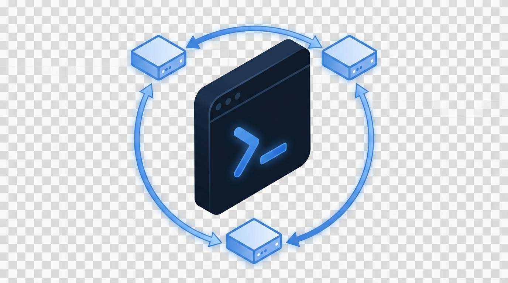

<div align="center">



# Remote Shell Runner

**Run PowerShell commands on many remote Windows hosts at once — from a single, polished GUI.**

[](LICENSE)
[](https://learn.microsoft.com/powershell/)
[]()

</div>

---

## What it does

**Remote Shell Runner** is a small Windows desktop app that lets you push a PowerShell script to a list of remote hosts in one click and watch the output come back live in a single console pane. Authentication is handled with a normal Windows credential, target hosts are reached over WinRM (PS-Remoting), and per-host output is captured so you can click any hostname after the run to inspect just that machine's log.

It's the tool I wished existed every time I had to run "the same five-line script on twenty servers" — without spawning 20 RDP windows or copy-pasting `Invoke-Command` into a console.

## Features

- **One-click multi-host execution** — paste hostnames, paste a script, hit **Execute**.
- **Live, color-coded output** in a terminal-style pane — info, success, errors are all distinguishable.
- **Per-host log review** — click a hostname after the run to view only that machine's output.
- **Stop button** with graceful soft-cancel for in-flight remote commands.
- **Credential validation** *before* the run, so you don't discover an auth failure 19 hosts in.
- **Export to log file** — save the full session output as UTF-8 `.log`.
- **Built-in Help / Requirements dialog** — users can self-diagnose WinRM, firewall, and credential issues without bothering you.
- **No console window**, no admin elevation required, no install — single self-contained EXE.

## Requirements

### On each target host
1. PowerShell Remoting (WinRM) enabled. Run as administrator on the target:
   ```powershell
   Enable-PSRemoting -Force
   ```
2. Firewall must allow inbound **TCP 5985 (HTTP)** or **5986 (HTTPS)** from your machine.
3. The credential you sign in with must have administrative rights on the target.

### On your machine
1. Windows PowerShell **5.1** or later (built-in on Windows 10 / 11 and Server 2016+).
2. For workgroup or cross-domain targets, add them to TrustedHosts (run once as admin):
   ```powershell
   Set-Item WSMan:\localhost\Client\TrustedHosts -Value 'host1,host2' -Force
   ```

A quick connectivity sanity-check from your machine:
```powershell
Test-WSMan -ComputerName <hostname>
```
A successful response means the host is reachable for remoting.

## Install

1. Download `RemoteShellRunner.exe` from this repository (or from the [**Releases**](https://github.com/nelladath/Remote-Shell-Runner/releases) page).
2. Double-click to run. No installer, no registry entries, no admin rights.

> First-launch SmartScreen note: because this is an unsigned community tool, Windows may show "Windows protected your PC" the first time you run a downloaded copy. Click **More info → Run anyway**. Subsequent launches are silent.

## Usage

1. **Enter your credentials** in the *Authentication* card (`DOMAIN\username`, `user@domain.com`, `.\username`, or `COMPUTERNAME\username`) and click **Connect**. The tool validates the password against AD/local SAM before letting you run anything.
2. **Paste hostnames** in *Target Hosts*, one per line.
3. **Paste the script** you want to run in *Commands*. The whole block runs as one script per host — variables persist within a host's run.
4. Click **Execute**. Watch live output in the right-hand pane.
5. After the run, click any hostname in the *Target Hosts* list to view only that host's output.
6. Use **Export...** to save the full session as a UTF-8 `.log` file.

## Repository layout

```
Remote-Shell-Runner/
├── assets/
│   └── RemoteShellRunner-logo.png    Project logo
├── .gitignore
├── LICENSE                           MIT
├── README.md                         You are here
└── RemoteShellRunner.exe             The application (self-contained, no install)
```

> The PowerShell source for this tool is maintained privately and is not published in this repository. The EXE here is the official, ready-to-run distribution.

## Roadmap / ideas

These are not promises, just things I'd consider if there's interest:

- Parallel host execution (currently serial, one host at a time)
- Save / load named credential profiles (DPAPI-encrypted)
- Per-host runtime + exit-code summary table
- Optional SSH transport for non-Windows targets

If any of these would help you, open an issue and say so.

## Feedback

Bug reports and feature requests are welcome — please open an **issue** on the repo. Source code is not currently accepted as pull requests since the project is maintained privately.

## License

[MIT](LICENSE) — free to use, modify, distribute, and ship in commercial products. Attribution appreciated but not required.

## Author

Built and maintained by **Sujin Nelladath** — Microsoft MVP.

[](https://www.linkedin.com/in/sujin-nelladath-8911968a/)

If this tool saved you time, a star on the repo is the friendliest way to say thanks.
